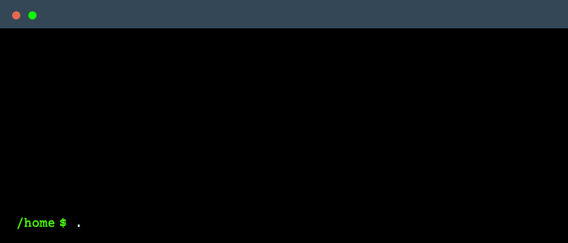

Neelanjan Manna is a Software Engineer at [Abormal AI](https://abnormal.ai/). He is a maintainer of the CNCF [LitmusChaos](https://litmuschaos.io/) project, a chaos engineering orchestration framework for validating the resiliency of cloud-native environments and a contributor to the CNCF [KEDA](https://keda.sh/) project. He is an avid speaker in the Cloud Native community organized meetups and conferences, including KubeCon NA, KCD Bengaluru, KCD Sri Lanka, and ChaosCarnival among others.

<br />



## Latest Blogs 📕
<!-- BLOG-POST-LIST:START -->
- [Building a Distributed Database from Scratch: The ConureDB Journey](https://neelanjan.dev/blog/building-a-distributed-database-from-scratch-the-conuredb-journey)
- [Exploring Rust by Building a Load Balancer: Insights from EchidnaLB](https://neelanjan.dev/blog/exploring-rust-by-building-a-load-balancer-insights-from-echidnalb)
- [Extending kubectl Utility With Plugins](https://neelanjan.dev/blog/extending-kubectl-utility-with-plugins)
- [How to Install Drone CI Server in Kubernetes](https://neelanjan.dev/blog/how-to-install-drone-ci-server-in-kubernetes)
<!-- BLOG-POST-LIST:END -->

## Dev Stats for This Week 📊
<!--START_SECTION:waka-->

```txt
Other             3 hrs 59 mins         █████████████░░░░░░░░░░░░   52.56 %
Python            1 hr 51 mins          ██████░░░░░░░░░░░░░░░░░░░   24.48 %
Go                1 hr 19 mins          ████▒░░░░░░░░░░░░░░░░░░░░   17.37 %
Text              10 mins               ▓░░░░░░░░░░░░░░░░░░░░░░░░   02.35 %
Markdown          7 mins                ▒░░░░░░░░░░░░░░░░░░░░░░░░   01.60 %
```

<!--END_SECTION:waka-->

## Let's Stay in Touch! 💬
<a href="mailto:hi@neelanjan.dev" target="blank"></a>
&nbsp;&nbsp;&nbsp;&nbsp;
<a href="https://linkedin.com/in/neelanjan00" target="blank"></a>
&nbsp;&nbsp;&nbsp;&nbsp;
<a href="https://twitter.com/NeelanjanManna" target="blank"></a>
&nbsp;&nbsp;&nbsp;&nbsp;
<a href="https://neelanjan.dev/feed.xml" target="blank"></a>
