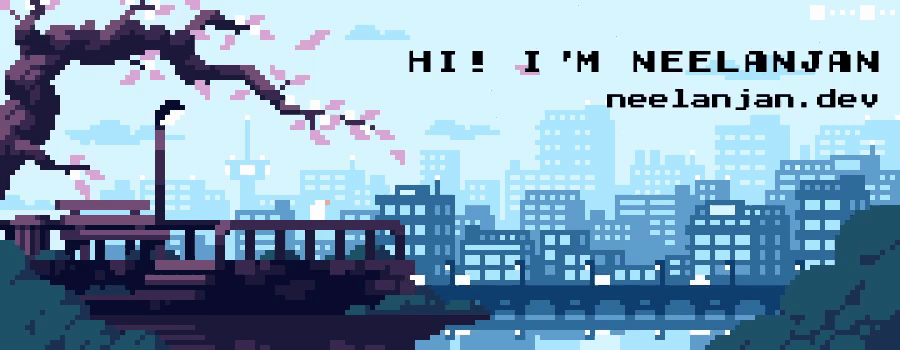

Neelanjan Manna is a Software Engineer at Harness. He is a contributor to the CNCF [LitmusChaos](https://litmuschaos.io/) project, a chaos engineering orchestration framework for validating the resiliency of cloud-native environments. He contributes to the development of emerging technologies including chaos engineering, distributed applications, and Kubernetes applications at [Harness](https://harness.io/).

<br />


## Latest Blogs
<!-- BLOG-POST-LIST:START -->
- [Why Did I Contribute to the LitmusChaos Project for Hacktoberfest 2021](https://neelanjanmanna.medium.com/why-did-i-contribute-to-the-litmuschaos-project-for-hacktoberfest-2021-1eaacdba0a03?source=rss-dcf285ed58a7------2)
- [GCP VM Disk Loss Experiment for LitmusChaos](https://medium.com/litmus-chaos/gcp-vm-disk-loss-experiment-for-litmuschaos-881e8edcc4b5?source=rss-dcf285ed58a7------2)
- [GCP VM Instance Stop Experiment for LitmusChaos](https://medium.com/litmus-chaos/gcp-vm-instance-stop-experiment-for-litmuschaos-3ea5b58266b2?source=rss-dcf285ed58a7------2)
- [Getting Started with Litmus 2.0 in Google Kubernetes Engine](https://medium.com/litmus-chaos/getting-started-with-litmus-2-0-in-google-kubernetes-engine-42dddb264a12?source=rss-dcf285ed58a7------2)
<!-- BLOG-POST-LIST:END -->

## Github Stats
<div style="display: flex">
    <span style="flex-basis: 50%">
        
    </span>
    <span style="flex-basis: 50%">
        <!--START_SECTION:waka-->

```text
No activity tracked
```

<!--END_SECTION:waka-->
    </span>
</div>

