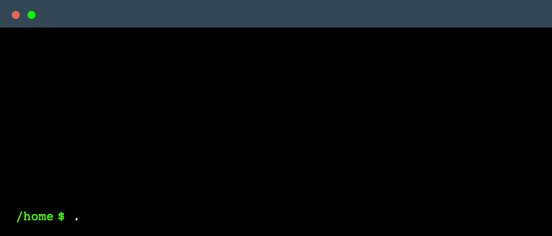

Neelanjan Manna is a Software Engineer at [Harness](https://harness.io/). He is a maintainer of the CNCF [LitmusChaos](https://litmuschaos.io/) project, a chaos engineering orchestration framework for validating the resiliency of cloud-native environments. He contributes to the development of emerging technologies including chaos engineering, distributed applications, and Kubernetes applications at Harness.

<br />



## Latest Blogs 📕
<!-- BLOG-POST-LIST:START -->
- [Building a Distributed Database from Scratch: The ConureDB Journey](https://neelanjan.dev/blog/building-a-distributed-database-from-scratch-the-conuredb-journey)
- [Exploring Rust by Building a Load Balancer: Insights from EchidnaLB](https://neelanjan.dev/blog/exploring-rust-by-building-a-load-balancer-insights-from-echidnalb)
- [Extending kubectl Utility With Plugins](https://neelanjan.dev/blog/extending-kubectl-utility-with-plugins)
- [How to Install Drone CI Server in Kubernetes](https://neelanjan.dev/blog/how-to-install-drone-ci-server-in-kubernetes)
<!-- BLOG-POST-LIST:END -->

## Dev Stats for This Week 📊
<!--START_SECTION:waka-->

```txt
Python       2 hrs 28 mins   ████████████░░░░░░░░░░░░░   47.46 %
Go           2 hrs 3 mins    █████████▓░░░░░░░░░░░░░░░   39.30 %
JSON         23 mins         ██░░░░░░░░░░░░░░░░░░░░░░░   07.40 %
Docker       10 mins         ▓░░░░░░░░░░░░░░░░░░░░░░░░   03.25 %
Bash         6 mins          ▓░░░░░░░░░░░░░░░░░░░░░░░░   02.20 %
```

<!--END_SECTION:waka-->

## Let's Stay in Touch! 💬
<a href="mailto:hi@neelanjan.dev" target="blank"></a>
&nbsp;&nbsp;&nbsp;&nbsp;
<a href="https://linkedin.com/in/neelanjan00" target="blank"></a>
&nbsp;&nbsp;&nbsp;&nbsp;
<a href="https://twitter.com/NeelanjanManna" target="blank"></a>
&nbsp;&nbsp;&nbsp;&nbsp;
<a href="https://neelanjan.dev/feed.xml" target="blank"></a>
